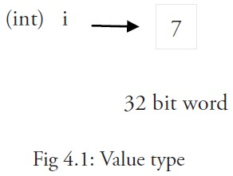

# 变量

声明变量的一般形式是使用 `var` 关键字：`var identifier type`。

这种语法能够按照从左至右的顺序阅读，使得代码更加容易理解。

示例：

```go
var a int
var b bool
var str string
```

你也可以改写成这种形式：

```go
var (
	a int
	b bool
	str string
)
```

这种因式分解关键字的写法一般用于声明全局变量。

#### 变量初始化

当一个变量被声明之后，系统自动赋予它该类型的零值：int 为 0，float 为 0.0，bool 为 false，string 为空字符串，指针为 nil。所有的内存在 Go 中都是经过初始化的：

#### 变量的命名规则

1. 遵循骆驼命名法，即首个单词小写，每个新单词的首字母大写，例如：`numShips` 和 `startDate`
2. 如果全局变量希望能够被外部包所使用，则需要将首个单词的首字母也大写。

#### 变量作用域

一个变量（常量、类型或函数）在程序中都有一定的作用范围，称之为作用域。

* 一个变量在函数体外声明，则被认为是全局变量，可以在整个包甚至外部包（被导出后）使用，不管你声明在哪个源文件里或在哪个源文件里调用该变量。
* 在函数体内声明的变量称之为局部变量，它们的作用域只在函数体内，参数和返回值变量也是局部变量。像 if 和 for 这些控制结构中声明的变量的作用域只在相应的代码块内。

变量可以编译期间就被赋值，赋值给变量使用运算符等号 `=`，当然也可以在运行时对变量进行赋值操作。

示例：

```go
a = 15
b = false
```

一般情况下，当变量a和变量b之间类型相同时，才能进行如`a = b`的赋值。

声明与赋值（初始化）语句也可以组合起来。

示例：

```go
var identifier [type] = value
var a int = 15
var i = 5
var b bool = false
var str string = "Go says hello to the world!"
```

Go 编译器的智商已经高到可以根据变量的值来自动推断其类型，因此，还可以使用下面的这些形式来声明及初始化变量：

```go
var a = 15
var b = false
var str = "Go says hello to the world!"
```

或：

```go
var (
	a = 15
	b = false
	str = "Go says hello to the world!"
	numShips = 50
	city string
)
```

不过自动推断类型并不是任何时候都适用的，当你想要给变量的类型并不是自动推断出的某种类型时，你还是需要显式指定变量的类型，例如：

```go
var n int64 = 2
```


当你在函数体内声明局部变量时，应使用简短声明语法 `:=`，例如：

```go
a := 1
```

变量的类型也可以在运行时实现自动推断，例如：

```go
var (
	HOME = os.Getenv("HOME")
	USER = os.Getenv("USER")
	GOROOT = os.Getenv("GOROOT")
)
```

下面这个例子展示了如何通过`runtime`包在运行时获取所在的操作系统类型，以及如何通过 `os` 包中的函数 `os.Getenv()` 来获取环境变量中的值，并保存到 string 类型的局部变量 path 中。

示例 

```go
package main

import (
	"fmt"
   "runtime"
	"os"
)

func main() {
	var goos string = runtime.GOOS
	fmt.Printf("The operating system is: %s\n", goos)
	path := os.Getenv("PATH")
	fmt.Printf("Path is %s\n", path)
}
```

如果你在 Windows 下运行这段代码，则会输出 `The operating system is: windows` 以及相应的环境变量的值；如果你在 Linux 下运行这段代码，则会输出 `The operating system is: linux` 以及相应的的环境变量的值。

### 值类型和引用类型

程序中所用到的内存在计算机中使用一堆箱子来表示（这也是人们在讲解它的时候的画法），这些箱子被称为 “ 字 ”。根据不同的处理器以及操作系统类型，所有的字都具有 32 位（4 字节）或 64 位（8 字节）的相同长度；所有的字都使用相关的内存地址来进行表示（以十六进制数表示）。

所有像 int、float、bool 和 string 这些基本类型都属于值类型，使用这些类型的变量直接指向存在内存中的值：



像数组和结构这些复合类型也是值类型。

当使用等号 `=` 将一个变量的值赋值给另一个变量时，如：`j = i`，实际上是在内存中将 i 的值进行了拷贝：


你可以通过 &i 来获取变量 i 的内存地址（第 4.9 节），例如：0xf840000040（每次的地址都可能不一样）。值类型的变量的值存储在栈中。

更复杂的数据通常会需要使用多个字，这些数据一般使用引用类型保存。

一个引用类型的变量 r1 存储的是 r1 的值所在的内存地址（数字），或内存地址中第一个字所在的位置。


这个内存地址被称之为指针（你可以从上图中很清晰地看到，第 4.9 节将会详细说明），这个指针实际上也被存在另外的某一个字中。

同一个引用类型的指针指向的多个字可以是在连续的内存地址中（内存布局是连续的），这也是计算效率最高的一种存储形式；也可以将这些字分散存放在内存中，每个字都指示了下一个字所在的内存地址。

当使用赋值语句 `r2 = r1` 时，只有引用（地址）被复制。

如果 r1 的值被改变了，那么这个值的所有引用都会指向被修改后的内容，在这个例子中，r2 也会受到影响。

在 Go 语言中，指针属于引用类型，其它的引用类型还包括 slices，maps和 channel。被引用的变量会存储在堆中，以便进行垃圾回收，且比栈拥有更大的内存空间。

### 打印

函数 `Printf` 可以在 fmt 包外部使用，这是因为它以大写字母 P 开头，该函数主要用于打印输出到控制台。通常使用的格式化字符串作为第一个参数：

```go
func Printf(format string, list of variables to be printed)
```

在示例 4.5 中，格式化字符串为：`"The operating system is: %s\n"`。

这个格式化字符串可以含有一个或多个的格式化标识符，例如：`%..`，其中 `..` 可以被不同类型所对应的标识符替换，如 `%s` 代表字符串标识符、`%v` 代表使用类型的默认输出格式的标识符。这些标识符所对应的值从格式化字符串后的第一个逗号开始按照相同顺序添加，如果参数超过 1 个则同样需要使用逗号分隔。使用这些占位符可以很好地控制格式化输出的文本。

函数 `fmt.Sprintf` 与 `Printf` 的作用是完全相同的，不过前者将格式化后的字符串以返回值的形式返回给调用者，因此你可以在程序中使用包含变量的字符串。

函数 `fmt.Print` 和 `fmt.Println` 会自动使用格式化标识符 `%v` 对字符串进行格式化，两者都会在每个参数之间自动增加空格，而后者还会在字符串的最后加上一个换行符。例如：

```go
fmt.Print("Hello:", 23)
```

将输出：`Hello: 23`。

### 简短形式，使用 := 赋值操作符

我们知道可以在变量的初始化时省略变量的类型而由系统自动推断，因此我们可以将它们简写为 `a := 50` 或 `b := false`。

a 和 b 的类型（int 和 bool）将由编译器自动推断。

这是使用变量的首选形式，但是它只能被用在函数体内，而不可以用于全局变量的声明与赋值。使用操作符 `:=` 可以高效地创建一个新的变量，称之为初始化声明。

**注意事项**

如果在相同的代码块中，我们不可以再次对于相同名称的变量使用初始化声明，例如：`a := 20` 就是不被允许的，编译器会提示错误 `no new variables on left side of :=`，但是 `a = 20` 是可以的，因为这是给相同的变量赋予一个新的值。

如果你在定义变量 a 之前使用它，则会得到编译错误 `undefined: a`。

如果你声明了一个局部变量却没有在相同的代码块中使用它，同样会得到编译错误，例如下面这个例子当中的变量 a：

```go
func main() {
   var a string = "abc"
   fmt.Println("hello, world")
}
```

尝试编译这段代码将得到错误 `a declared and not used`。

此外，单纯地给 a 赋值也是不够的，这个值必须被使用，所以使用 `fmt.Println("hello, world", a)` 会移除错误。

但是全局变量是允许声明但不使用。

其他的简短形式为：

同一类型的多个变量可以声明在同一行，如：

```text
var a, b, c int
```

\(这是将类型写在标识符后面的一个重要原因\)

多变量可以在同一行进行赋值，如：

```text
a, b, c = 5, 7, "abc"
```

上面这行假设了变量 a，b 和 c 都已经被声明，否则的话应该这样使用：

```text
a, b, c := 5, 7, "abc"
```

右边的这些值以相同的顺序赋值给左边的变量，所以 a 的值是 `5`， b 的值是 `7`，c 的值是 `"abc"`。

这被称为 **并行** 或 **同时** 赋值。

如果你想要交换两个变量的值，则可以简单地使用 `a, b = b, a`。

空白标识符 `_` 也被用于抛弃值，如值 `5` 在：`_, b = 5, 7` 中被抛弃。

`_` 实际上是一个只写变量，你不能得到它的值。这样做是因为 Go 语言中你必须使用所有被声明的变量，但有时你并不需要使用从一个函数得到的所有返回值。

并行赋值也被用于当一个函数返回多个返回值时，比如这里的 `val` 和错误 `err` 是通过调用 `Func1` 函数同时得到：`val, err = Func1(var1)`。

### init 函数

变量除了可以在全局声明中初始化，也可以在 init 函数中初始化。这是一类非常特殊的函数，它不能够被人为调用，而是在每个包完成初始化后自动执行，并且执行优先级比 main 函数高。

每个源文件都只能包含一个 init 函数。初始化总是以单线程执行，并且按照包的依赖关系顺序执行。

一个可能的用途是在开始执行程序之前对数据进行检验或修复，以保证程序状态的正确性。

示例 

```go
package trans

import "math"

var Pi float64

func init() {
   Pi = 4 * math.Atan(1) // init() function computes Pi
}
```

在它的 init 函数中计算变量 Pi 的初始值。

init 函数经常被用在当一个程序开始之前调用后台执行的 goroutine，如下面这个例子当中的 `backend()`：

```text
func init() {
   // setup preparations
   go backend()
}
```


